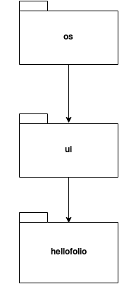

# Arkkitehtuurikuvaus

Ohessa näkyy koodin arkkitehtuurikaavio:

## Rakenne

Koodin pakkausrakenne on seuraavanlainen:

Pakkaus *os* hoitaa koko järjestelmän käyttämisen, *ui* hoitaa "graafisen" puolen, ja *hellofolio*:ssa on sovelluslogiikka.

## Päätoiminnallisuudet

Alla näkyy esimerkki sekvenssikaaviosta, jos ohjelmaa ajetaan, halutaan kirjautua jollakin jo olemassaolevalla käyttäjätunnuksella, sekä halutaan nähdä tämän 
käyttäjän portfolion sisältö.

