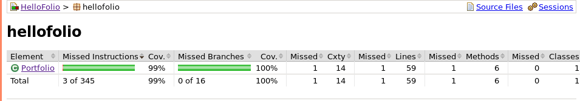

# Testausdokumentti
Ohjelmaa on testattu automatiosoiduin yksikkötestein JUnitilla, sekä manuaalisesti järjestelmätason testeillä.

## Yksikkö- ja integraatiotestaus

### Sovelluslogiikka

Kaikki testit keskittyvät *Portfolio*-luokan testaamiseen, sillä siellä tapahtuu kaikki ohjelman logiikka, johon toiminta perustuu. Tästä johtuen *Portfolio*-luokasta onkin testattu 100% rivi- sekä haarautumakattavuudella.

